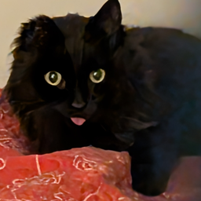

# Berettitiland Modpack

  

Client-side modpack for the Berettitiland Minecraft SMP — a private whitelisted survival server focused on exploration and community.

This is a **private server** and is not open for public registration.

---

## Requirements

- [Prism Launcher](https://prismlauncher.org/) or [Modrinth App](https://modrinth.com/app)
- A valid Minecraft: Java Edition license

---

## Installation

1. Download the latest `.mrpack` from the [Releases](../../releases/latest) page
2. Open [Prism Launcher](https://prismlauncher.org/) or [Modrinth App](https://modrinth.com/app)
3. Add a new instance and select **Import from file**
4. Select the downloaded `.mrpack`

> **Note:** Prism Launcher is recommended. The Modrinth App does not currently support updating an existing instance from a local `.mrpack` file, meaning updates require a full reinstall.

---

## Updating

In **Prism Launcher**, right-click your instance and re-import the new `.mrpack`. Your world saves, resource packs, shaders, and personally added mods will be preserved.

In the **Modrinth App**, you will need to create a new instance from the updated `.mrpack`. Back up any personal files beforehand.

---

## What's Included

### Performance

| Mod                                                                      | Description                                                  |
| :----------------------------------------------------------------------- | :----------------------------------------------------------- |
| [Sodium](https://modrinth.com/mod/sodium)                                | Rendering engine replacement for significantly improved FPS  |
| [Sodium Extra](https://modrinth.com/mod/sodium-extra)                    | Additional graphics options not exposed by Sodium by default |
| [Reese's Sodium Options](https://modrinth.com/mod/reeses-sodium-options) | Improved UI for Sodium settings                              |
| [Iris](https://modrinth.com/mod/iris)                                    | Shader support compatible with Sodium                        |
| [Lithium](https://modrinth.com/mod/lithium)                              | General-purpose game logic optimizations                     |
| [FerriteCore](https://modrinth.com/mod/ferrite-core)                     | Memory usage optimizations                                   |

### Server Compatibility

| Mod                                                          | Description                                                         |
| :----------------------------------------------------------- | :------------------------------------------------------------------ |
| [Waystones](https://modrinth.com/mod/waystones)              | Fast travel system — place waystones to teleport between locations  |
| [Comforts](https://modrinth.com/mod/comforts)                | Sleeping bags and hammocks — sleep anywhere without resetting spawn |
| [FallingTree](https://modrinth.com/mod/fallingtree)          | Chop entire trees by breaking the base block                        |
| [Gravestones](https://modrinth.com/mod/pneumono_gravestones) | Drops a grave on death to recover your items                        |
| [Mob Ignore Me](https://modrinth.com/mod/mob-ignore-me)      | Per-player control over which mobs target you                       |

### QOL

| Mod                                                                     | Description                                                                   |
| :---------------------------------------------------------------------- | :---------------------------------------------------------------------------- |
| [Coords HUD](https://modrinth.com/mod/coords-hud)                       | Displays your current coordinates on screen                                   |
| [Nether Coords](https://modrinth.com/mod/nether-coords)                 | Displays the corresponding overworld coordinates near nether portals          |
| [Controlify](https://modrinth.com/mod/controlify)                       | Full controller and gamepad support with button remapping                     |
| [Simple Magnets](https://modrinth.com/mod/simple-magnets) | Experience and block magnet |

### Resource Packs

| Pack                                                                                            | Description                                                                     |
| :---------------------------------------------------------------------------------------------- | :------------------------------------------------------------------------------ |
| [Faithful 64x](https://modrinth.com/resourcepack/faithful-64x)                                  | Doubles vanilla texture resolution while staying true to the original art style |
| [ToonCraft](https://modrinth.com/resourcepack/tooncraft-je-a-wonderfully-adorable-texture-pack) | Stylized cartoon aesthetic                                                      |
| [Fresh Animations](https://modrinth.com/resourcepack/fresh-animations)                          | Natural mob animations with custom models and textures                          |
| [Better Leaves](https://modrinth.com/resourcepack/better-leaves)                                | Improved leaf rendering                                                         |
| [Default Dark Mode](https://modrinth.com/resourcepack/default-dark-mode)                        | Dark mode for all vanilla UI elements                                           |

### Shaders

| Shader                                                                           | Description                              |
| :------------------------------------------------------------------------------- | :--------------------------------------- |
| [Complementary Reimagined](https://modrinth.com/shader/complementary-reimagined) | Balanced and beautiful, good performance |
| [BSL Shaders](https://modrinth.com/shader/bsl-shaders)                           | Warm and cinematic                       |
| [Sildur's Vibrant Shaders](https://modrinth.com/shader/sildurs-vibrant-shaders)  | Lighter option, good for mid-range GPUs  |

Select your preferred shader in **Options > Video Settings > Shader Packs**.

---

## Live Map

A live map of the server is available at [map.fcusson.com](https://map.fcusson.com), rendered via BlueMap and updated as the world is explored.

---

## CI/CD

This modpack is managed with [packwiz](https://packwiz.infra.link/) and released automatically via GitHub Actions.

On every push to `main`, the workflow checks whether the version in `pack.toml` has changed. If it has, the modpack is exported as a `.mrpack`, a versioned GitHub release is created with the changelog, and the `latest` release is updated. This ensures `latest` always reflects the most recent stable release.

**Stack:**

- Minecraft 26.2, Fabric
- Modpack management: packwiz
- CI/CD: GitHub Actions
- Release format: Modrinth `.mrpack`
